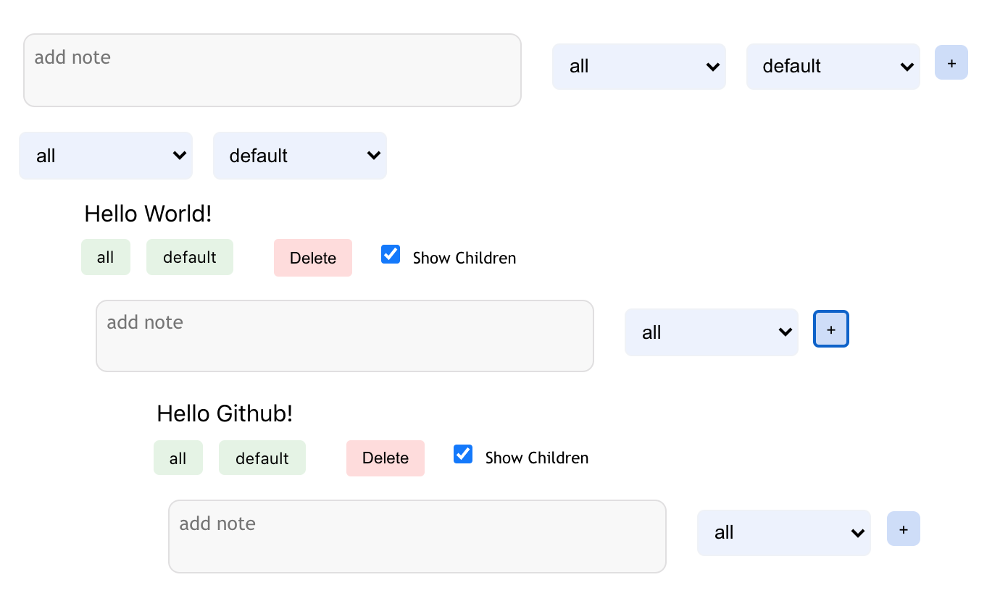

<h1 align="center">Tempest ⛈</h1>

Arrange the way you think.

## How Does Tempest Work?

Thoughts, at first glance, are like storms –– chaotic and messy and unpredictable. Pick one thought and tagging tugging, however, and you'll find that each idea has sub-ideas and sub-sub-ideas. The flow of thought operates like a tree –– with roots and branches and connections. Every thought can further have ideas, every idea resources, and every resource concerns. 

This is the idea that Tempest leverages –– start a project, create your own tags, and add thoughts, resources, concerns, bugs, and ideas as you go. If you're tired with using a thought journal, with typing out ideas in one unsearchable google doc, with forgetting important details scattered across apps and bookmarks, then this is the app for you.

## Demo 
Start your own Tempest at [storm.amks.me](https://storm.amks.me)!

###### Made with love by [AMKS](https://amks.me). Reach out at [t.co/amks](https://twitter.com/amksomani).
